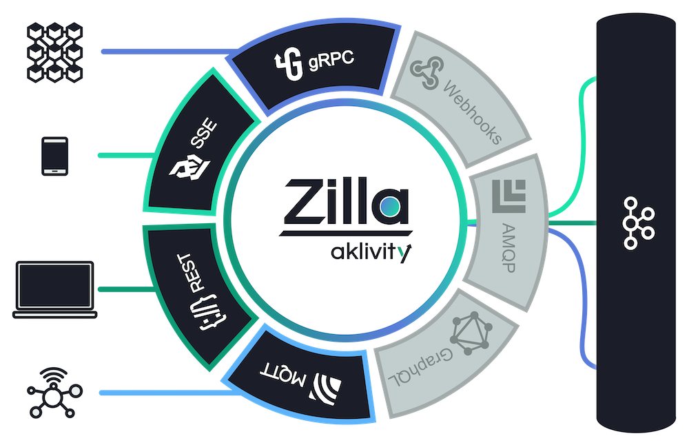

<div id="top"></div>
<div align="center">
  
</div>

</br>

<div align="center"> 

  <!--[![Build Status][build-status-image]][build-status]-->
  [![Latest Release][release-latest-image]][release-latest]
  [![Slack Community][community-image]][community-join]
  [![Artifact HUB][artifact-hub-shield]][artifact-hub]
  
</div>

<h3 align="center">
  <a href="https://docs.aklivity.io/zilla/"><b>Documentation</b></a> &bull;
  <a href="https://docs.aklivity.io/zilla/latest/tutorials/quickstart/kafka-proxies.html"><b>Quickstart</b></a> &bull;
  <a href="https://github.com/aklivity/zilla-examples"><b>Examples</b></a> &bull;
  <a href="https://www.aklivity.io/blog"><b>Blog</b></a>  
</h3>

# 🦎 Zilla: Multi-protocol event-native edge/service proxy

Zilla abstracts Apache Kafka® for web applications, IoT clients and microservices. With Zilla, Kafka topics can be securely and reliably exposed via user-defined `REST`, `Server-Sent Events (SSE)`, `MQTT`, or `gRPC` APIs.

Zilla has no external dependencies and does not rely on the Kafka Consumer/Producer API or Kafka Connect. Instead, it natively supports the Kafka wire protocol and uses advanced protocol mediation to establish stateless API entry points into Kafka. Zilla also addresses security enforcement, observability and connection offloading on the data path.

When Zilla is deployed alongside Apache Kafka®, any application or service can seamlessly be made event-driven.

## Contents

- [Getting Started](#getting-started)
- [Key Features](#key-features)
  - [HTTP-Kafka Proxying](#http-kafka-proxying)
  - [gRPC-Kafka Proxying](#grpc-kafka-proxying)
  - [MQTT-Kafka Proxying](#mqtt-kafka-proxying)
- [Resources](#resources)
- [How Zilla Works](#how-zilla-works)
- [FAQs](#faqs)
- [Community](#community)
- [License](#license)

## Getting Started

The fastest way to try out Zilla is via the [Quickstart](https://docs.aklivity.io/zilla/latest/tutorials/quickstart/kafka-proxies.html), which walks you through publishing and subscribing to Kafka through `REST`, `gRPC`, `SSE` and `MQTT` API entry points. The Quickstart uses Aklivity’s public [Postman Workspace](https://www.postman.com/aklivity-zilla/workspace/aklivity-zilla-quickstart/overview) with pre-defined API endpoints and a Docker Compose stack running pre-configured Zilla and Kafka instances to make things as easy as possible.

## Key Features

### HTTP-Kafka Proxying

Support for both REST and SEE Kafka proxying. Configure an application-centric REST API on top of Kafka for synchronous CRUD operations or correlated request-response over Kafka topics. Make existing OpenAPI service definitions asynchronous and event-driven by mapping them to Kafka. Reliably broadcast/fanout data out to clients at web-scale.

[Find out more](https://docs.aklivity.io/zilla/latest/concepts/kafka-proxies/http-proxy.html)

### gRPC-Kafka Proxying

Implement gRPC service definitions from protobuf files to produce and consume messages via Kafka topics.

[Find out more](https://docs.aklivity.io/zilla/latest/concepts/kafka-proxies/grpc-proxy.html)

### MQTT-Kafka Proxying

Turn Kafka into an MQTT broker by persisting MQTT messages and client state across Kafka topics.

[Find out more](https://docs.aklivity.io/zilla/latest/concepts/kafka-proxies/mqtt-proxy.html)

### Deployment, Performance & Other

- [x] **OpenAPI and AsyncAPI Support** — Use OpenAPI and AsyncAPI specifications for configuration and/or validation enforcement.
- [x] **Apicurio and Karapace Schema Registry Integrations** — Integration with external schema registries for a variety of data formats.
- [x] **Realtime Cache** — Local cache synchronized with Kafka for specific topics, even when no clients are connected. The cache is stateless and recovers automatically. It is consistent across different Zilla instances without peer communication.
- [x] **Filtering** — Local cache indexes message key and headers upon retrieval from Kafka, supporting efficiently filtered reads from cached topics.
- [x] **Fan-in, Fan-out** — For SSE-Kafka and MQTT-Kafka proxying, the local cache uses a small number of connections to interact with Kafka brokers, independent of the number of connected clients.
- [x] **Authorization** — Specific routed topics can be guarded to enforce required client privileges.
- [x] **Helm Chart** — Generic Zilla Helm chart available.
- [x] **Auto-reconfigure** — Detect changes in `zilla.yaml` and reconfigure Zilla automatically.
- [x] **Prometheus Integration** — Export Zilla metrics to Prometheus for observability and auto-scaling.
- [x] **Declarative Configuration** — API mappings and endpoints inside Zilla are declaratively configured via YAML.
- [x] **Kafka Security** — Connect Zilla to Kafka over `PLAINTEXT`, `TLS/SSL`, `TLS/SSL with Client Certificates`, `SASL/PLAIN`, and `SASL/SCRAM`.

## <a name="resources"> Resources

### 📚 Read the docs

- **[Zilla Documentation](https://docs.aklivity.io/zilla/latest/how-tos/install.html):** Guides, tutorials and references to help understand how to use Zilla and configure it for your use case.
- **[Product Roadmap][zilla-roadmap]:** Check out our plan for upcoming releases. 
- **[Zilla Examples](https://github.com/aklivity/zilla-examples)**: A collection of pre-canned Zilla feature demos.
- **[Eventful Petstore Demo](https://github.com/aklivity/zilla-demos/tree/main/petstore):** See Zilla make the OpenAPI/Swagger Petstore service event-driven by mapping it onto Kafka in just a few lines of YAML.
- **[Taxi Demo](https://github.com/aklivity/zilla-demos/tree/main/petstore):** A demo of a taxi-based IoT deployment with Zilla, Kafka, OpenAPIs and AsyncAPIs.

### 📝 Check out blog posts

- **[Bring your own REST APIs for Apache Kafka](https://www.aklivity.io/post/bring-your-own-rest-apis-for-apache-kafka):** Zilla enables application-specific REST APIs. See how it's not just another Kafka-REST proxy.
- **[Modern Eventing with CQRS, Redpanda and Zilla](https://www.aklivity.io/post/modern-eventing-with-cqrs-redpanda-and-zilla):** Learn about the event-driven nature of CQRS, common challenges while implementing it, and how Zilla solves them with Redpanda.
- **[End-to-end Streaming Between gRPC Services via Kafka](https://www.aklivity.io/post/end-to-end-streaming-between-grpc-services-via-kafka):** Learn how to integrate gRPC with Kafka event streaming; securely, reliably and scalably.
- **[Zilla Hails a Taxi](https://www.aklivity.io/post/zilla-hails-a-taxi):** IoT telemetry at scale? MQTT, Zilla, and Kafka can make it happen.

### <a name="support"> ❓ Get support

- **[Community Slack](https://www.aklivity.io/slack):** Join technical discussions, ask questions, and meet other users!
- **[GitHub Issues](https://github.com/aklivity/zilla/issues):** Report bugs or issues with Zilla.
- **[Contact Us](https://www.aklivity.io/contact):** Submit non-techinal questions and inquiries.

## <a name="how-zilla-works"> How Zilla Works

Inside Zilla, every protocol, whether it is `TCP`, `TLS`, `HTTP`, `Kafka`, `gRPC`, etc., is treated as a stream, so mediating between protocols simplifies to mapping protocol-specific metadata.

Zilla’s declarative configuration defines a routed graph of protocol decoders, transformers, encoders and caches that combine to provide a secure and stateless API entry point into an event-driven architecture. This “routed graph” can be visualized and maintained with the help of the [Zilla VS Code extension](https://docs.aklivity.io/zilla/latest/reference/vscode/).

### <a name="performance"> A Note on Performance

Zilla has been designed from the ground up to be very high-performance. Inside, all data flows over shared memory as streams with back pressure between CPU cores, allowing Zilla to take advantage of modern multi-core hardware. The code base is written in system-level Java and uses low-level, high-performance data structures, with no locks and no object allocation on the data path.

You can get a sense of the internal efficiencies of Zilla by running the `BufferBM` microbenchmark for the internal data structure that underpins all data flow inside the Zilla runtime.

```shell
git clone https://github.com/aklivity/zilla
cd zilla
./mvnw clean install
```

```shell
cd runtime/engine/target
java -jar ./engine-develop-SNAPSHOT-shaded-tests.jar BufferBM
```

<b>Note:</b> with Java 16 or higher add `--add-opens=java.base/java.io=ALL-UNNAMED` just after `java` to avoid getting errors related to reflective access across Java module boundaries when running the benchmark.

```text
Benchmark                  Mode  Cnt         Score        Error  Units
BufferBM.batched          thrpt   15  15315188.949 ± 198360.879  ops/s
BufferBM.multiple         thrpt   15  18366915.039 ± 420092.183  ops/s
BufferBM.multiple:reader  thrpt   15   3884377.984 ± 112128.903  ops/s
BufferBM.multiple:writer  thrpt   15  14482537.055 ± 316551.083  ops/s
BufferBM.single           thrpt   15  15111915.264 ± 294689.110  ops/s
```

This benchmark was executed on 2019 MacBook Pro laptop with `2.3 GHZ 8-Core Intel i9 chip` and `16 GB of DDR4 RAM`, showing about `14-15 million messages per second`.

## <a name="faqs"> FAQs

### Is Zilla production-ready?

Yes, Zilla has been built with the highest performance and security considerations in mind, and the Zilla engine has been deployed inside enterprise production environments. If you are looking to deploy Zilla for a mission-critical use case and need enterprise support, please [contact us](https://www.aklivity.io/contact).

### Does Zilla only work with Apache Kafka?

Currently, yes, although nothing about Zilla is Kafka-specific — Kafka is just another protocol in Zilla's transformation pipeline. Besides expanding on the list of supported protocols and mappings, we are in the process of adding more traditional proxying capabilities, such as rate-limiting and security enforcement, for existing Async and OpenAPI endpoints. See the [Zilla Roadmap][zilla-roadmap] for more details.

### Another REST-Kafka Proxy? How is this one different?

Take a look at our [blog post](https://www.aklivity.io/post/bring-your-own-rest-apis-for-apache-kafka), where we go into detail about how Zilla is different **TL;DR** Zilla supports creating application-style REST APIs on top of Kafka, as opposed to providing just a system-level HTTP API. Most notably, this unlocks correlated request-response over Kafka topics.

### What does Zilla's performance look like?

Please see the note above [on performance](#performance).

### What's on the roadmap for Zilla?

Please review the [Zilla Roadamp][zilla-roadmap]. If you have a request or feedback, we would love to hear it! Get in touch through our community [channels](#support).

## <a name="community"> 🌱 Community

Looking to contribute to Zilla? Check out the [Contributing to Zilla](./.github/CONTRIBUTING.md) guide.
✨We value all contributions, whether it is source code, documentation, bug reports, feature requests or feedback!

### Many Thanks To Our Contributors!

<a href="https://github.com/aklivity/zilla/graphs/contributors">
  
</a>

## <a name="license"> License

Zilla is made available under the [Aklivity Community License](./LICENSE-AklivityCommunity). This is an open source-derived license that gives you the freedom to deploy, modify and run Zilla as you see fit, as long as you are not turning into a standalone commercialized “Zilla-as-a-service” offering. Running Zilla in the cloud for your own workloads, production or not, is completely fine.

<!-- Links -->
[build-status-image]: https://github.com/aklivity/zilla/workflows/build/badge.svg
[build-status]: https://github.com/aklivity/zilla/actions
[community-image]: https://img.shields.io/badge/slack-@aklivitycommunity-blue.svg?logo=slack
[community-join]: https://www.aklivity.io/slack
[artifact-hub-shield]: https://img.shields.io/endpoint?url=https://artifacthub.io/badge/repository/zilla
[artifact-hub]: https://artifacthub.io/packages/helm/zilla/zilla
[release-latest-image]: https://img.shields.io/github/v/tag/aklivity/zilla?label=release
[release-latest]: https://github.com/aklivity/zilla/pkgs/container/zilla
[zilla-roadmap]: https://github.com/orgs/aklivity/projects/4/views/1

<p align="right">(<a href="#top">🔼 Back to top</a>)</p>
