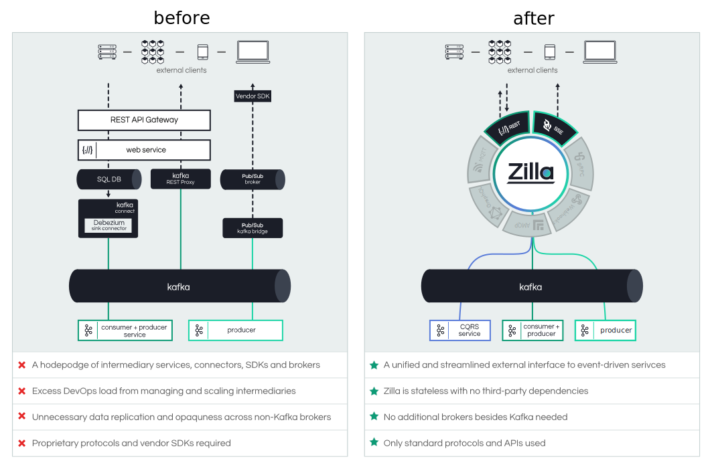
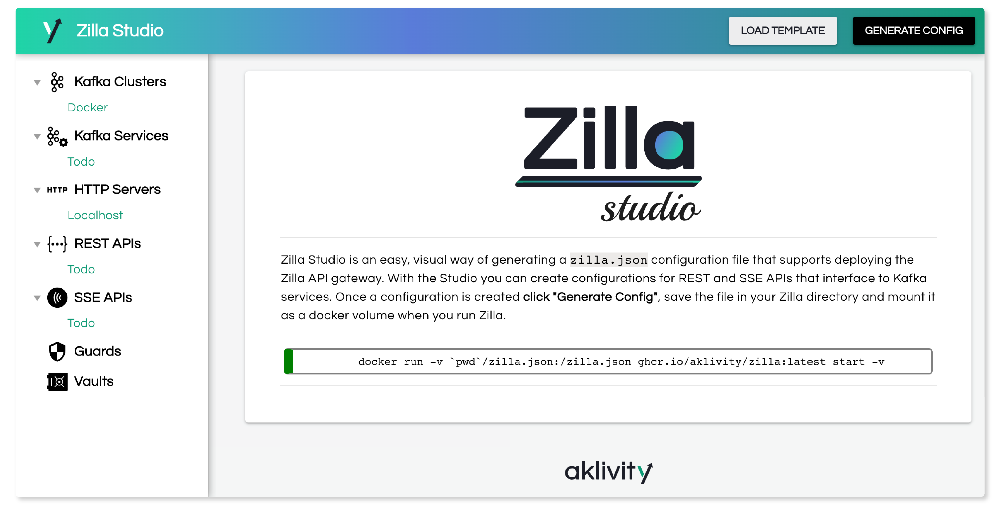
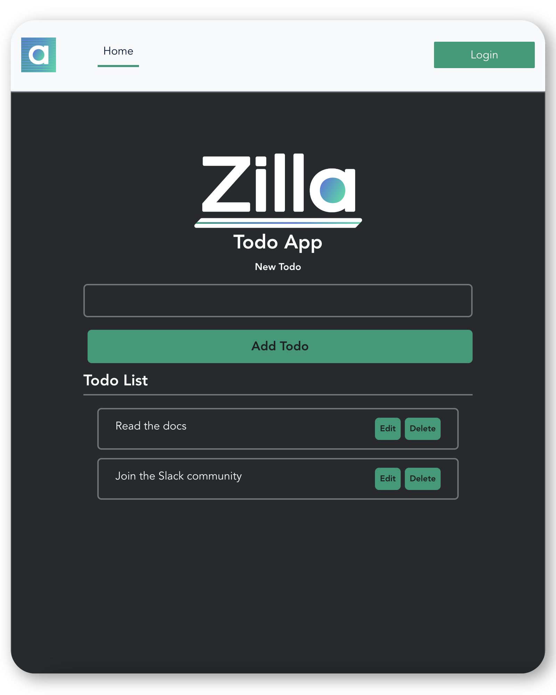

<div align="center">
  
  
</div>

</br>
<h1 align="center">Event-driven API Gateway</h1>

<div align="center">
  
  [![Build Status][build-status-image]][build-status]
  [![Slack Community][community-image]][community-join]
  
</div>

<h3 align="center">
  <a href="https://docs.aklivity.io/zilla/"><b>Documentation</b></a> &bull;
  <a href="https://docs.aklivity.io/zilla/get-started"><b>Getting Started</b></a> &bull;
  <a href="https://github.com/aklivity/zilla-examples"><b>Examples</b></a> &bull; 
  <a href="https://www.aklivity.io/blog"><b>Blog</b></a>  
</h3>

## About Zilla
Zilla is a next-generation API gateway built for event-driven architectures and streaming. It is the most seamless and reliable way of interfacing edge clients (mobile apps, browsers, partner systems, etc.) to Apache Kafka-based microservices and data.

Zilla's declarative configuration defines a routed graph of protocol decoders, transformers, encoders and caches that combine to provide a secure and stateless API entry point to your event-driven architecture.

With Zilla, apps and services can use standard protocols such as HTTP, SSE and the native Kafka protocol (see [roadmap](#roadmap) for additional protocols on the way) to directly consume and produce Kafka event-streams over the internet. 

<b>Zilla aims to:</b>

1. Streamline event-driven architectures and make them easier to manage by eliminating the need for intermediary brokers and web servers, sink/source connectors, and change data capture (CDC) tooling.
2. Simplify creating scalable, asynchronous backends that can support realtime frontend experiences.

## Features
Zilla is designed on the fundamental principle that every data flow is a stream, and that streams can be composed together to create efficient protocol transformation pipelines. This concept of a stream holds at both the network level for communication protocols and also at the application level for data processing.

### Kafka Proxies
Zilla natively supports the Kafka protocol and is able to efficiently transform other protocols to and from it. 

- <b><a href="https://docs.aklivity.io/zilla/reference/zilla.json/binding-http-kafka">HTTP ⇄ Kafka</a></b> — 
  Transforms HTTP 1.1/HTTP 2  requests and responses to Kafka topic streams with control over the topic, message key, message headers, message value and reply-to topic. JWT authentication supported.
- <b><a href="https://docs.aklivity.io/zilla/reference/zilla.json/binding-http-kafka">SSE ← Kafka</a></b> — 
  Transforms Kafka topic streams to Server Sent Event (SSE) streams for reliable data streaming/pushing down to web clients. Secured via JWTs and Zilla’s continuous authentication, which re-authorizes clients without abruptly terminating their message streams.

### Other
- **CORS** — enable CORS so users can make browser based requests to Zilla APIs.
- **Entitlement-based Messaging** — restrict access to endpoints based on client entitlement privileges.
- **SSL/TLS** — support for TLS virtual hosting.

<div align="center">
  </br>
  
</div>

## Getting Started
### Running Zilla via Docker
Run the latest Zilla release with default empty configuration via docker.

```
docker run ghcr.io/aklivity/zilla:latest start -v
```
```
{
  "name": "default"
}
started
```

#### Configure Zilla to behave as a `tcp` `echo` server in 2mins.

First create a local `zilla.yaml` with the following contents.
```yaml
---
name: example
bindings:
  tcp_server0:
    type: tcp
    kind: server
    options:
      host: 0.0.0.0
      port: 12345
    exit: echo_server0
  echo_server0:
    type: echo
    kind: server
```
Then run Zilla again, this time mounting your local `zilla.yaml` as a docker volume file.
```
docker run -v `pwd`/zilla.yaml:/etc/zilla/zilla.yaml ghcr.io/aklivity/zilla:latest start -v
```
Now, try it out using `netcat`.
```bash
nc localhost 12345
```
```
Hello, world
Hello, world
```

### Connect your Kafka and Create REST and SSE API Endpoints
Zilla can connect to Kafka over `PLAINTEXT`, `TLS/SSL`, `TLS/SSL with Client Certificates`, `SASL/PLAIN`, and `SASL/SCRAM`.

Follow the [docs][zilla-get-started] that show you how to modify your `zilla.yaml` to connect it to your Kafka and expose select topics over REST and SSE endpoints.
<br>
#### Zilla Studio
Besides directly creating and modifying a `zilla.yaml` file, you can use the <a href="https://zilla-studio.aklivity.io/#/">Zilla Studio</a> GUI tool to generate one instead. This simplifies getting started with Zilla even further and helps visualize a Zilla configuration.
<div align="center" float="left">
      
</div>
<br></br>

### Tutorial: Build and secure a CQRS Todo app with Zilla and Kafka Streams
A [step-by-step guide][zilla-todo-tutorial] that shows how to build a CQRS Todo App with Zilla and Kafka streams, and achieve the following:
- Provide a list of Todo tasks that is shared by all clients
- Support optimistic locking with conflict detection when attempting to update a Todo task
- Deliver updates in near real-time when a Todo task is created, modified, or deleted
- Demonstrate a user interface driving the Tasks API
- Support scaling Todo task reads and writes
<!--
<div align="center" float="left">
      
    <p><i>Vue.js + Zilla + Kafka</i></p>
</div>
-->
<br>

### Zilla Examples
You can also quickly test out Zilla by running preconfigured Zilla configurations for various protocols.

| Name | Description|
|------|------------|
| [tcp.echo](https://github.com/aklivity/zilla-examples/tree/main/tcp.echo) | Echoes bytes sent to the TCP server |
| [tcp.reflect](https://github.com/aklivity/zilla-examples/tree/main/tcp.reflect) | Echoes bytes sent to the TCP server, broadcasting to all TCP clients |
| [tls.echo](https://github.com/aklivity/zilla-examples/tree/main/tls.echo) | Echoes encrypted bytes sent to the TLS server |
| [tls.reflect](https://github.com/aklivity/zilla-examples/tree/main/tls.reflect) | Echoes encrypted bytes sent to the TLS server, broadcasting to all TLS clients |
| [http.filesystem](https://github.com/aklivity/zilla-examples/tree/main/http.filesystem) | Serves files from a directory on the local filesystem |
| [http.echo](https://github.com/aklivity/zilla-examples/tree/main/http.echo) | Echoes request sent to the HTTP server from an HTTP client |
| [http.echo.jwt](https://github.com/aklivity/zilla-examples/tree/main/http.echo.jwt) | Echoes request sent to the HTTP server from a JWT-authorized HTTP client |
| [http.proxy](https://github.com/aklivity/zilla-examples/tree/main/http.proxy)  | Proxy request sent to the HTTP server from an HTTP client |
| [http.kafka.sync](https://github.com/aklivity/zilla-examples/tree/main/http.kafka.sync) | Correlates requests and responses over separate Kafka topics |
| [http.kafka.async](https://github.com/aklivity/zilla-examples/tree/main/http.kafka.async) | Correlates requests and responses over separate Kafka topics, asynchronously |
| [http.kafka.cache](https://github.com/aklivity/zilla-examples/tree/main/http.kafka.cache) | Serves cached responses from a Kafka topic, detect when updated |
| [http.kafka.oneway](https://github.com/aklivity/zilla-examples/tree/main/http.kafka.oneway) | Sends messages to a Kafka topic, fire-and-forget |
| [http.kafka.sasl.scram](https://github.com/aklivity/zilla-examples/tree/main/http.kafka.sasl.scram) | Sends messages to a SASL/SCRAM enabled Kafka |
| [http.redpanda.sasl.scram](https://github.com/aklivity/zilla-examples/tree/main/http.redpanda.sasl.scram) | Sends messages to a SASL/SCRAM enabled Redpanda Cluster |
| [amqp.reflect](https://github.com/aklivity/zilla-examples/tree/main/amqp.reflect) | Echoes messages published to the AMQP server, broadcasting to all receiving AMQP clients |
| [mqtt.reflect](https://github.com/aklivity/zilla-examples/tree/main/mqtt.reflect) | Echoes messages published to the MQTT server, broadcasting to all receiving MQTT clients |
| [sse.kafka.fanout](https://github.com/aklivity/zilla-examples/tree/main/sse.kafka.fanout) | Streams messages published to a Kafka topic, applying conflation based on log compaction |
| [sse.proxy.jwt](https://github.com/aklivity/zilla-examples/tree/main/sse.proxy.jwt) | Proxies messages delivered by the SSE server, enforcing streaming security constraints |
| [ws.echo](https://github.com/aklivity/zilla-examples/tree/main/ws.echo) | Echoes messages sent to the WebSocket server |
| [ws.reflect](https://github.com/aklivity/zilla-examples/tree/main/ws.reflect) | Echoes messages sent to the WebSocket server, broadcasting to all WebSocket clients |


## Use Cases
### Migrate/Bridge REST to Event-Driven
Interface REST apps and services to event-streams with app specific API declarations, enabling them as first-class participants inside an event-driven architecture. Achieve a CQRS event-sourcing design pattern with minimal effort.

**Key Zilla Features:**
- HTTP request-response interaction with Kafka-based microservices 
- HTTP event-driven caching populated by messages from a Kafka topic
- Secure HTTP request-response APIs using JWT access tokens

### Create streaming/push APIs for realtime web apps (live chat/collaboration, geo-tracking, gamming, etc.)
As a developer, you can focus on writing and testing your event-driven microservices with technologies such as Kafka consumers and producers, you can define your web and mobile APIs using Zilla, and then you can deploy securely at global scale.

**Key Zilla Features:**
- Reliable message streaming from a Kafka topic via Server-Sent Events with fan-out capability 
- Secure Server-Sent Events streams using continuous authorization via JWT access tokens


## Performance
End-to-end latency and throughput testing are are in the works. In the meantime, you can get a sense of the internal efficiencies of Zilla by running the `BufferBM` microbenchmark for the internal data structure that underpins all data flow inside the Zilla runtime.

```
git clone https://github.com/aklivity/zilla
cd zilla
./mvnw clean install
```

```
cd runtime/engine/target
java -jar ./engine-develop-SNAPSHOT-shaded-tests.jar BufferBM
```
<b>Note:</b> with Java 16 or higher add ` --add-opens=java.base/java.io=ALL-UNNAMED` just after `java` to avoid getting errors related to reflective access across Java module boundaries when running the benchmark.

```
Benchmark                  Mode  Cnt         Score        Error  Units
BufferBM.batched          thrpt   15  15315188.949 ± 198360.879  ops/s
BufferBM.multiple         thrpt   15  18366915.039 ± 420092.183  ops/s
BufferBM.multiple:reader  thrpt   15   3884377.984 ± 112128.903  ops/s
BufferBM.multiple:writer  thrpt   15  14482537.055 ± 316551.083  ops/s
BufferBM.single           thrpt   15  15111915.264 ± 294689.110  ops/s
```

This benchmark was executed on 2019 MacBook Pro laptop with `2.3 GHZ 8-Core Intel i9 chip` and `16 GB of DDR4 RAM`, showing about `14-15 million messages per second`.

## Roadmap
Zilla is designed from the ground up to be extensible and we anticipate adding support for several new capabilities:

**Protocols and Transformations**
 - [gRPC, proxy and Kafka mapping](https://github.com/orgs/aklivity/projects/4?pane=issue&itemId=24080080)
 - [MQTT, proxy and Kafka mapping](https://github.com/orgs/aklivity/projects/4/views/1?pane=issue&itemId=7132841)
 - GraphQL, proxy and Kafka mapping
 - WebHooks, Kafka mapping
 - AMQP, proxy and Kafka mapping
 - WebSocket, proxy and Kafka mapping
 - HTTP, proxy, including HTTP/3

**Integrations** 
 - [Kubernetes integration](https://github.com/orgs/aklivity/projects/4?pane=issue&itemId=6735594)
 - [OpenTelemetry integration](https://github.com/orgs/aklivity/projects/4?pane=issue&itemId=6735584)
 - OpenAPI integration
 - AsyncAPI integration
 - Avro integration

Please see the [Roadmap project](https://github.com/orgs/aklivity/projects/4) and let us know in the [Slack community][community-join] if you have additional suggestions.

## Build from source
```bash
./mvnw clean install
```
This creates a local `docker` image with version `develop-SNAPSHOT`.


## License
The project is licensed under the [Aklivity Community License](LICENSE-AklivityCommunity), except for selected components
which are under the [Apache 2.0 license](LICENSE-Apache).
See `LICENSE` file in each subfolder for detailed license agreement.

[build-status-image]: https://github.com/aklivity/zilla/workflows/build/badge.svg
[build-status]: https://github.com/aklivity/zilla/actions

[community-image]: https://img.shields.io/badge/slack-@aklivitycommunity-blue.svg?logo=slack
[community-join]: https://join.slack.com/t/aklivitycommunity/shared_invite/zt-sy06wvr9-u6cPmBNQplX5wVfd9l2oIQ

[zilla-docs]: https://docs.aklivity.io/zilla
[zilla-get-started]: https://docs.aklivity.io/zilla/get-started
[zilla-examples]: https://github.com/aklivity/zilla-examples
[zilla-todo-tutorial]: https://docs.aklivity.io/zilla/get-started/build-todo-app
