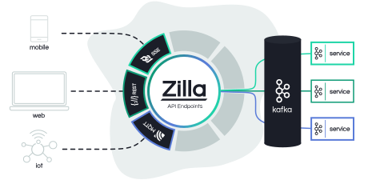

# Zilla Project

[![Build Status][build-status-image]][build-status]


Zilla connects web and mobile applications to event-driven microservices using standard protocols, such as HTTP, Server-Sent Events and Kafka.

Zilla is designed on the fundamental principle that _every data flow is a stream_, and that streams can be composed together to create efficient protocol transformation pipelines. This concept of a stream holds at both the network level for communication protocols and also at the application level for data processing.

Zilla's declarative configuration defines a routed graph of protocol decoders, transformers, encoders and caches that combine to provide a secure and stateless API entry point to your event-driven architecture.

For example, when deployed in front of a Kafka cluster, Zilla can be configured to support:
 - HTTP request-response interaction with Kafka-based micro-services
 - HTTP event-driven caching populated by messages from a Kafka topic
 - reliable message streaming from a Kafka topic via Server-Sent Events
 - secure HTTP request-response APIs using JWT access tokens
 - secure Server-Sent Events streams using continuous authorization via JWT access tokens



As a developer, you can focus on writing and testing your event-driven microservices with technologies such as Kafka consumers and producers, you can define your web and mobile APIs using Zilla, and then you can deploy securely at global scale.

Read the [docs](https://docs.aklivity.io/zilla). Try the [examples](https://github.com/aklivity/zilla-examples). Join the [Slack community](https://join.slack.com/t/aklivitycommunity/shared_invite/zt-sy06wvr9-u6cPmBNQplX5wVfd9l2oIQ).

## Build
```bash
./mvnw clean install
```

## License

The project is licensed under the [Aklivity Community License](LICENSE-AklivityCommunity), except for selected components
which are under the [Apache 2.0 license](LICENSE-Apache).
See `LICENSE` file in each subfolder for detailed license agreement.

[build-status-image]: https://github.com/aklivity/zilla/workflows/build/badge.svg
[build-status]: https://github.com/aklivity/zilla/actions
