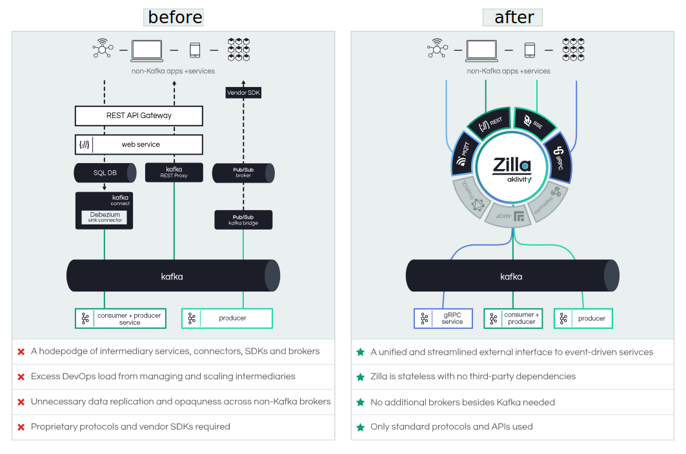
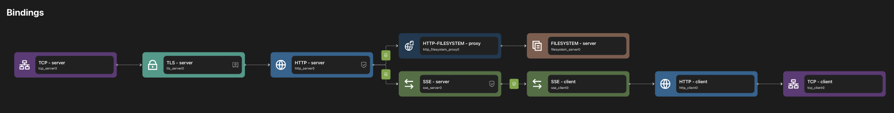

<div align="center">
  
  
</div>

</br>
<h1 align="center">Event-driven API Gateway</h1>

<div align="center">
  
  [![Build Status][build-status-image]][build-status]
  [![Slack Community][community-image]][community-join]
  
</div>

<h3 align="center">
  <a href="https://docs.aklivity.io/zilla/"><b>Documentation</b></a> &bull;
  <a href="https://docs.aklivity.io/zilla/next/get-started/install/"><b>Get Started</b></a> &bull;
  <a href="https://github.com/aklivity/zilla-examples"><b>Examples</b></a> &bull; 
  <a href="https://www.aklivity.io/blog"><b>Blog</b></a>  
</h3>

## About Zilla
Zilla is a next-generation API gateway built for event-driven architectures and streaming. It is the most seamless and reliable way of interfacing non-Kafka clients running at the edge (mobile apps, browsers, partner systems, etc.) or inside the datacenter (gRPC services) to Apache Kafka-based microservices and data.

Zilla's declarative configuration defines a routed graph of protocol decoders, transformers, encoders and caches that combine to provide a secure and stateless API entry point to your event-driven architecture.

With Zilla, apps and services can use standard protocols such as HTTP, SSE, gRPC and the native Kafka protocol (see roadmap for additional protocols on the way) to directly consume and produce Kafka event-streams.

### Why Zilla?
- **Unify your event-driven architecture** by enabling any non-Kafka app or service to seamlessly consume and produce event-streams.
- **Offload DevOps burden and TCO** associated with deploying and managing Kafka integration middleware, such as Kafka Connect and custom Kafka consumer/producer API implementations.
- **Streamline your event-driven architecture’s security footprint** by centralizing authorization and authentication of all non-Kafka clients.
- **Maximize your investment in Kafka** by enabling non-Kafka developers to build their applications on top of event-streams, and take advantage of Kafka’s performance and streaming data processing capabilities.


## Features
Zilla is designed on the fundamental principle that every data flow is a stream, and that streams can be composed together to create efficient protocol transformation pipelines. This concept of a stream holds at both the network level for communication protocols and also at the application level for data processing.

### Kafka Proxies
Zilla natively supports the Kafka protocol and is able to efficiently transform other protocols to and from it. 

- [**REST ⇄ Kafka**](https://docs.aklivity.io/zilla/reference/zilla.json/binding-http-kafka) — 
  Transforms HTTP 1.1/HTTP 2 requests and responses to Kafka topic streams with control over the topic, message key, message headers, message value and reply-to topic. Enables exposing Kafka topics and services via an application-centric REST API (as opposed to a topic-centric, system-level API as with the Confluent REST Proxy). JWT authentication supported.
- [**SSE ← Kafka**](https://docs.aklivity.io/zilla/reference/zilla.json/binding-http-kafka) — 
  Transforms Kafka topic streams to Server Sent Event (SSE) streams for reliable data streaming/pushing down to web clients. Secured via JWTs and Zilla’s continuous authentication, which re-authorizes clients without abruptly terminating their message streams.
- [**Kafka → gRPC**](https://docs.aklivity.io/zilla/next/reference/zilla.yaml/binding/binding-grpc-kafka.html) & [**gRPC ⇄ Kafka**](https://docs.aklivity.io/zilla/next/reference/zilla.yaml/binding/binding-kafka-grpc.html) — 
  Transforms Kafka streams to gRPC streams and vice-versa. Support for both Kafka to gRPC server streaming (reliable and unreliable) as well as correlated request-response.

### Other
- [x] **Realtime Cache** — local cache synchronized with Kafka for specific topics, even when no clients are currently connected. Stateless, recovers automatically, consistent across different Zilla instances without peer communication.
- [x] **Filtering** — local cache indexes message key and headers upon retrieval from Kafka, supporting efficient filtered reads from cached topics.
- [x] **Fan-in, fan-out** — local cache uses a small number of connections to interact with Kafka brokers, independent of the number of connected clients.
- [x] **Authorization** — Specific routed topics can be guarded to enforce required client privileges.
- [x] [**Kubernetes Deployment**](https://github.com/aklivity/zilla-examples/tree/main/kubernetes.prometheus.autoscale) — deploy Zilla via a Helm Chart with metrics-driven autoscaling.
- [x] [**Prometheus Integration**](https://github.com/aklivity/zilla-examples/tree/main/kubernetes.prometheus.autoscale) — export Zilla metrics to Prometheus for observability.
- [x] **Kafka Security** — connect Zilla to Kafka over PLAINTEXT, TLS/SSL, TLS/SSL with Client Certificates, SASL/PLAIN, and SASL/SCRAM. 
- [x] **Declartive YAML Configuration** — no coding required, API mappings and endpoints inside Zilla are declaratively configured via YAML.
- [x] **CORS** — enable CORS so users can make browser based requests to Zilla APIs.

<div align="center">
  </br>
  
</div>

## Get Started
For guidance on installation, configuration and deployment see our [documentation](https://docs.aklivity.io/zilla/next/).

### Run Zilla via Docker
Run the latest Zilla release with default empty configuration via docker. You can also run Zilla via [Helm](https://docs.aklivity.io/zilla/next/get-started/install/#running-zilla-via-helm).

```
docker run ghcr.io/aklivity/zilla:latest start -v
```
```
{
  "name": "default"
}
started
```

### Configure Zilla to behave as a `tcp` `echo` server in 2mins.

First create a local `zilla.yaml` with the following contents.
```yaml
---
name: example
bindings:
  tcp_server0:
    type: tcp
    kind: server
    options:
      host: 0.0.0.0
      port: 12345
    exit: echo_server0
  echo_server0:
    type: echo
    kind: server
```
Then run Zilla again, this time mounting your local `zilla.yaml` as a docker volume file.
```
docker run -v `pwd`/zilla.yaml:/etc/zilla/zilla.yaml ghcr.io/aklivity/zilla:latest start -v
```
Now, try it out using `netcat`.
```bash
nc localhost 12345
```
```
Hello, world
Hello, world
```

### Configure Zilla Kafka Proxies
Follow the Quickstarts to configure and test Kafka proxies.
- [REST-Kafka Proxy Quickstart](https://docs.aklivity.io/zilla/next/guides/kafka-proxies/sse-proxy.html)
- [SSE-Kafka Proxy Quickstart](https://docs.aklivity.io/zilla/next/guides/kafka-proxies/rest-proxy.html)
- [gRPC-Kafka Proxy Quickstart](https://docs.aklivity.io/zilla/next/guides/kafka-proxies/grpc-proxy.html)

#### Connect Zilla to your own Kafka
The above Quickstarts do not require you to run Kafka as they rely on [Zilla Examples](https://github.com/aklivity/zilla-examples), which come pre-packaged with a Kafka broker. Zilla works with all open source and vendor-enhanced Kafka deployments.
- [Apache Kafka](https://docs.aklivity.io/zilla/next/guides/connecting-to-kafka/generic.html)
- [Confluent Cloud](https://docs.aklivity.io/zilla/next/guides/connecting-to-kafka/confluent-cloud.html)
- [Redpanda](https://docs.aklivity.io/zilla/next/guides/connecting-to-kafka/redpanda.html)
- [Amazon MSK](https://docs.aklivity.io/zilla/next/guides/connecting-to-kafka/amazon-msk.html)
- [Aiven](https://docs.aklivity.io/zilla/next/guides/connecting-to-kafka/aiven.html)

### The Zilla VSCode Extension
API endpoints inside Zilla are defined by way of a streaming transformation pipeline (see [Zilla's Runtime Configuration](https://docs.aklivity.io/zilla/next/reference/zilla.yaml/)). To help visualize and manage this pipeline, a [VSCode Extension](https://docs.aklivity.io/zilla/next/get-started/vscode) is avaliable. The extension also supports writing and maintaining your configuration with Zilla-specific YAML autocomplete and validation.

<div align="center" float="left">
      
</div>

## Community
If you have any questions, need assistance or have ideas/recommendations, please join our developer [Slack community][community-join].

### Contributing
Looking to contribute to Zilla? Here are some possibilities:
- Star this repo and follow us on [Twitter](https://twitter.com/aklivityinc).
- Create issues every time you feel something is missing or goes wrong.
- Provide pull requests for open issues, especially for those with a [good first issue](https://github.com/aklivity/zilla/issues?q=is%3Aissue+is%3Aopen+label%3A%22good+first+issue%22) label.

✨We value all contributions whether its source code, documentation, bug reports, feature requests or feedback!

## Roadmap
Zilla is designed from the ground up to be extensible and we are working on adding support for several new capabilities:

**Protocols and Transformations**
 - [MQTT, proxy and Kafka mapping](https://github.com/orgs/aklivity/projects/4/views/1?pane=issue&itemId=7132841)
 - GraphQL, proxy and Kafka mapping
 - WebHooks, Kafka mapping
 - AMQP, proxy and Kafka mapping
 - WebSocket, proxy and Kafka mapping
 - HTTP, proxy, including HTTP/3

**Integrations** 
 - [OpenTelemetry integration](https://github.com/orgs/aklivity/projects/4?pane=issue&itemId=6735584)
 - Export OpenAPI and AsyncAPI definitions from a Zilla configuration file
 - Schema Registry integration

Please see the [Roadmap project](https://github.com/orgs/aklivity/projects/4) and let us know in the [Slack community][community-join] if you have additional suggestions.

## Performance
End-to-end latency and throughput testing are in the works. In the meantime, you can get a sense of the internal efficiencies of Zilla by running the `BufferBM` microbenchmark for the internal data structure that underpins all data flow inside the Zilla runtime.

```
git clone https://github.com/aklivity/zilla
cd zilla
./mvnw clean install
```

```
cd runtime/engine/target
java -jar ./engine-develop-SNAPSHOT-shaded-tests.jar BufferBM
```
<b>Note:</b> with Java 16 or higher add ` --add-opens=java.base/java.io=ALL-UNNAMED` just after `java` to avoid getting errors related to reflective access across Java module boundaries when running the benchmark.

```
Benchmark                  Mode  Cnt         Score        Error  Units
BufferBM.batched          thrpt   15  15315188.949 ± 198360.879  ops/s
BufferBM.multiple         thrpt   15  18366915.039 ± 420092.183  ops/s
BufferBM.multiple:reader  thrpt   15   3884377.984 ± 112128.903  ops/s
BufferBM.multiple:writer  thrpt   15  14482537.055 ± 316551.083  ops/s
BufferBM.single           thrpt   15  15111915.264 ± 294689.110  ops/s
```

This benchmark was executed on 2019 MacBook Pro laptop with `2.3 GHZ 8-Core Intel i9 chip` and `16 GB of DDR4 RAM`, showing about `14-15 million messages per second`.

## Build from source
```bash
./mvnw clean install
```
This creates a local `docker` image with version `develop-SNAPSHOT`.

## License
The project is licensed under the [Aklivity Community License](LICENSE-AklivityCommunity), except for selected components
which are under the [Apache 2.0 license](LICENSE-Apache).
See `LICENSE` file in each subfolder for detailed license agreement.

[build-status-image]: https://github.com/aklivity/zilla/workflows/build/badge.svg
[build-status]: https://github.com/aklivity/zilla/actions

[community-image]: https://img.shields.io/badge/slack-@aklivitycommunity-blue.svg?logo=slack
[community-join]: https://www.aklivity.io/slack
[zilla-docs]: https://docs.aklivity.io/zilla/latest/
[zilla-get-started]: https://docs.aklivity.io/zilla/latest/get-started
[zilla-examples]: https://github.com/aklivity/zilla-examples
[zilla-todo-tutorial]: https://docs.aklivity.io/zilla/get-started/build-todo-app
