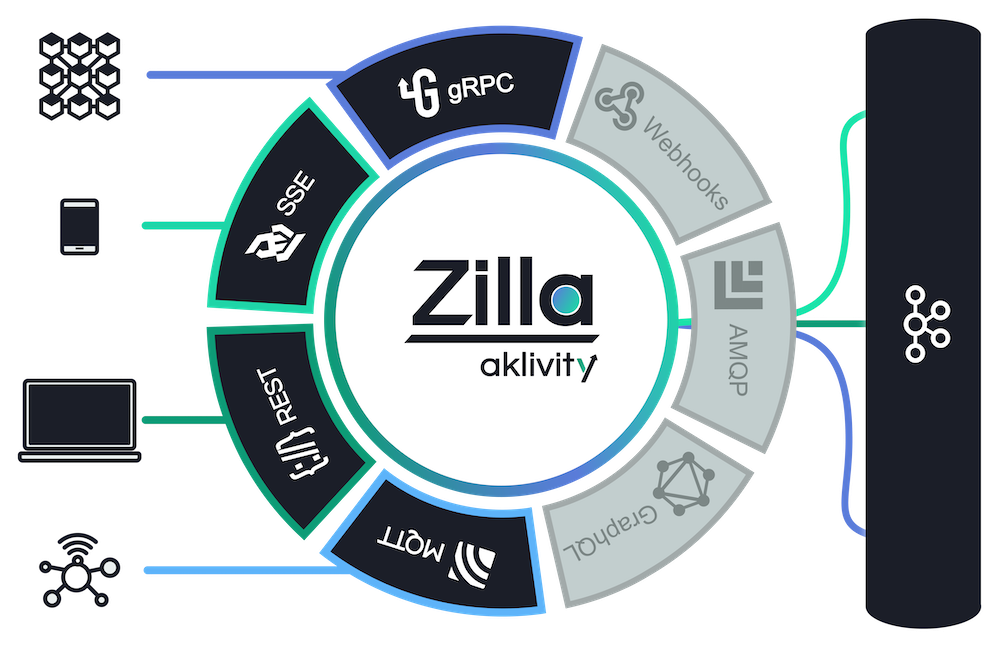

<div id="top"></div>
<div align="center">
  
</div>

</br>

<div align="center"> 

  <!--[![Build Status][build-status-image]][build-status]-->
  [![Latest Release][release-latest-image]][release-latest]
  [![Slack Community][community-image]][community-join]
  [![Artifact HUB][artifact-hub-shield]][artifact-hub]
  
</div>

<h3 align="center">
  <a href="https://docs.aklivity.io/zilla/"><b>Docs</b></a> &bull;
  <a href="https://docs.aklivity.io/zilla/latest/getting-started/quickstart/"><b>Quickstart</b></a> &bull;
  <a href="/examples"><b>Examples</b></a> &bull;
  <a href="https://github.com/aklivity/zilla-demos"><b>Demos</b></a> &bull;
  <a href="https://www.aklivity.io/blog"><b>Blog</b></a>  
</h3>

# 🦎 Zilla: a multi-protocol edge & service proxy

**Zilla** is a stateless, cloud-native proxy that bridges the gap between event-driven architectures and modern application protocols. It lets web apps, IoT devices, and microservices speak directly to **Apache Kafka®** — using HTTP, SSE, gRPC, MQTT, or WebSocket — without writing any custom integration code.

Think of Zilla as the **protocol translation layer** for your event-driven stack: declaratively configured via YAML, deployable anywhere, and capable of replacing custom connectors, MQTT brokers, and ad-hoc middleware with a single lightweight binary.

## Why Zilla?

Modern architectures use Kafka as a backbone for real-time data — but most clients (browsers, mobile apps, IoT devices) don't speak Kafka natively. The traditional answer is a tangle of REST bridges, MQTT brokers, WebSocket servers, and custom glue code.

**Zilla eliminates that complexity.**

| Without Zilla | With Zilla |
|---|---|
| Custom REST-to-Kafka bridge code | Declarative `zilla.yaml` routes |
| Separate MQTT broker + Kafka connector | Native MQTT-Kafka proxying built in |
| Hand-rolled JWT validation per service | JWT continuous authorization at the proxy |
| Schema validation scattered across services | Centralized Apicurio/Karapace enforcement |
| Multiple middleware hops, added latency | Zero-copy, protocol-native proxying |

## What Can Zilla Do?

### As a Kafka API Gateway
Expose Kafka topics as first-class REST, SSE, gRPC, or MQTT endpoints — without a single line of broker-side code.

| Use Case | Example |
|---|---|
| REST CRUD over Kafka topics | [`http.kafka.crud`](examples/http.kafka.crud) |
| Real-time fan-out to SSE clients | [`sse.kafka.fanout.jwt`](examples/sse.kafka.fanout.jwt) |
| Turn Kafka into an MQTT broker | [`mqtt.kafka.proxy`](examples/mqtt.kafka.proxy) |
| Async request-reply over Kafka | [`http.kafka.async`](examples/http.kafka.async) |
| gRPC event mesh via Kafka | [`grpc.kafka.proxy`](examples/grpc.kafka.proxy) |
| AsyncAPI-driven MQTT gateway | [`asyncapi.mqtt.kafka.proxy`](examples/asyncapi.mqtt.kafka.proxy) |

### As a Service Sidecar
Deploy alongside any service to handle cross-cutting concerns:
- **Authentication** — JWT validation with continuous stream authorization for SSE
- **Schema enforcement** — validate payloads against OpenAPI / AsyncAPI / Avro / Protobuf schemas
- **TLS termination** — offload TLS handling from your services
- **Observability** — emit metrics to Prometheus and traces to OpenTelemetry

## Get Started in 60 Seconds

**Prerequisites:** Docker Compose

```bash
git clone https://github.com/aklivity/zilla.git
cd zilla/examples
docker compose --project-directory http.kafka.crud up -d
```

This starts Zilla, a local Kafka cluster, and a Kafka UI at [http://localhost:8080](http://localhost:8080/ui/clusters/local/all-topics).

Try it — create a Kafka-backed resource over plain HTTP:

```bash
# Create an item (produces a Kafka message)
curl -X POST http://localhost:7114/items \
  -H 'Content-Type: application/json' \
  -d '{"name": "widget", "price": 9.99}'

# Fetch all items (consumes from Kafka topic)
curl http://localhost:7114/items
```

Watch messages appear in real time on the Kafka UI. Then stop with:

```bash
docker compose --project-directory http.kafka.crud down
```

→ **[Full Quickstart Guide](https://docs.aklivity.io/zilla/latest/getting-started/quickstart/)**


## How It Works

Zilla is configured entirely in a single `zilla.yaml` file. You declare named **bindings** — each one specifying a protocol, a role (`server` / `client` / `proxy`), and routing rules. Bindings chain together to form a pipeline.

Here's the full config for the HTTP-to-Kafka CRUD example above:

```yaml
name: example
bindings:

  north_tcp_server:
    type: tcp
    kind: server
    options:
      host: 0.0.0.0
      port: 7114
    routes:
      - when:
          - port: 7114
        exit: north_http_server

  north_http_server:
    type: http
    kind: server
    routes:
      - when:
          - headers:
              :scheme: http
        exit: north_http_kafka_mapping

  north_http_kafka_mapping:
    type: http-kafka
    kind: proxy
    routes:
      - when:
          - method: POST
            path: /items
        exit: north_kafka_cache_client
        with:
          capability: produce
          topic: items-snapshots
          key: ${idempotencyKey}
      - when:
          - method: GET
            path: /items
        exit: north_kafka_cache_client
        with:
          capability: fetch
          topic: items-snapshots
          merge:
            content-type: application/json
      - when:
          - method: GET
            path: /items/{id}
        exit: north_kafka_cache_client
        with:
          capability: fetch
          topic: items-snapshots
          filters:
            - key: ${params.id}
      - when:
          - method: PUT
            path: /items/{id}
        exit: north_kafka_cache_client
        with:
          capability: produce
          topic: items-snapshots
          key: ${params.id}
      - when:
          - method: DELETE
            path: /items/{id}
        exit: north_kafka_cache_client
        with:
          capability: produce
          topic: items-snapshots
          key: ${params.id}

  north_kafka_cache_client:
    type: kafka
    kind: cache_client
    exit: south_kafka_cache_server

  south_kafka_cache_server:
    type: kafka
    kind: cache_server
    options:
      bootstrap:
        - items-snapshots
    exit: south_kafka_client

  south_kafka_client:
    type: kafka
    kind: client
    options:
      servers:
        - ${{env.KAFKA_BOOTSTRAP_SERVER}}
    exit: south_tcp_client

  south_tcp_client:
    type: tcp
    kind: client

telemetry:
  exporters:
    stdout_logs_exporter:
      type: stdout
```

→ **[See all examples](examples/)** | **[Configuration reference](https://docs.aklivity.io/zilla/latest/reference/config/overview.html)**


## Install

Zilla has no external dependencies. Pick your preferred deployment method:

**Homebrew**
```bash
brew tap aklivity/tap
brew install zilla
zilla start -ve -c ./zilla.yaml
```

**Docker**
```bash
docker pull ghcr.io/aklivity/zilla
docker run ghcr.io/aklivity/zilla:latest start -v
```

**Helm (Kubernetes)**
```bash
helm install zilla oci://ghcr.io/aklivity/charts/zilla \
  --namespace zilla --create-namespace --wait \
  --values values.yaml \
  --set-file zilla\\.yaml=zilla.yaml
```

Both single-node and clustered deployments are supported.


## Key Features

**Protocol support:** HTTP · SSE · gRPC · MQTT · WebSocket · Kafka (native)

**API specifications:** Import OpenAPI and AsyncAPI schemas directly as Zilla config — no translation step required.

**Schema registries:** Integrate with Apicurio or Karapace to validate `JSON`, `Avro`, and `Protobuf` payloads at the proxy layer.

**Security:** JWT-based authentication including [continuous stream authorization](https://www.aklivity.io/post/a-primer-on-server-sent-events-sse) for long-lived SSE connections.

**Observability:** Native Prometheus metrics and OpenTelemetry tracing exporters.

**Performance:** Stateless architecture with zero-copy message flow means near-zero latency overhead. See the [benchmark](https://www.aklivity.io/post/proxy-benefits-with-near-zero-latency-tax-aklivity-zilla-benchmark-series-part-1).


## Who Is Zilla For?

- **Kafka / data platform engineers** who want to share Kafka clusters across teams or simplify multi-protocol integration without custom connectors.
- **Application developers** building on real-time data streams without deep Kafka expertise.
- **API architects** who want to drive infrastructure from OpenAPI and AsyncAPI schemas.


## Zilla Plus (Enterprise)

The open-source **Zilla Community Edition** covers most use cases. [**Zilla Plus**](https://www.aklivity.io/zilla-gateway) adds enterprise capabilities:

- **Virtual Clusters** — multi-tenant Kafka cluster isolation
- **Secure Public/Private Access** — mTLS, custom Kafka domains, VPC-aware routing
- **IoT Ingest & Control** — production-grade MQTT broker over Kafka at scale
- **Enterprise support** — SLAs, dedicated engineering access

→ [Compare editions](https://www.aklivity.io/products/zilla-plus)


## <a name="resources"> Resources

### 📚 Read the docs

**Learning**
- [📖 Documentation](https://docs.aklivity.io/zilla/latest) — Concepts, deployment guides, and full configuration reference
- [⚡ Quickstart](https://docs.aklivity.io/zilla/latest/getting-started/quickstart/) — Running in under 60 seconds
- [🧪 Examples](examples/) — Bite-sized, runnable demos for every supported protocol
- [🎬 Demos](https://github.com/aklivity/zilla-demos) — Full-stack demos including the Petstore and Taxi IoT deployment
- [🗺️ Roadmap](https://github.com/orgs/aklivity/projects/4/views/1) — What's coming next

**Blog highlights**
- [Bring your own REST APIs for Apache Kafka](https://www.aklivity.io/post/bring-your-own-rest-apis-for-apache-kafka)
- [End-to-end Streaming Between gRPC Services via Kafka](https://www.aklivity.io/post/end-to-end-streaming-between-grpc-services-via-kafka)
- [Modern Eventing with CQRS, Redpanda and Zilla](https://www.aklivity.io/post/modern-eventing-with-cqrs-redpanda-and-zilla)
- [Centralized Data Governance Across Protocols](https://www.aklivity.io/post/the-why-how-of-centralized-data-governance-in-zilla-across-protocols)
- [How Zilla Works](https://www.aklivity.io/post/how-zilla-works)

**Community & Support**
- [💬 Community Slack](https://www.aklivity.io/slack) — Ask questions, share what you're building
- [🐛 GitHub Issues](https://github.com/aklivity/zilla/issues) — Bug reports and feature requests
- [📬 Contact](https://www.aklivity.io/contact) — Non-technical inquiries and enterprise sales

## <a name="community"> Contributing

Looking to contribute to Zilla? Check out the [Contributing to Zilla](./.github/CONTRIBUTING.md) guide.
✨We value all contributions, whether source code, documentation, bug reports, feature requests or feedback!

### Many Thanks To Our Contributors!

<a href="https://github.com/aklivity/zilla/graphs/contributors">
  
</a>

## <a name="license"> License

Zilla is made available under the [Aklivity Community License](./LICENSE-AklivityCommunity). This is an open source-derived license that gives you the freedom to deploy, modify and run Zilla as you see fit, as long as you are not turning into a standalone commercialized “Zilla-as-a-service” offering. Running Zilla in the cloud for your own workloads, production or not, is completely fine.


<!-- Links -->
[build-status-image]: https://github.com/aklivity/zilla/workflows/build/badge.svg
[build-status]: https://github.com/aklivity/zilla/actions
[community-image]: https://img.shields.io/badge/slack-@aklivitycommunity-blue.svg?logo=slack
[community-join]: https://www.aklivity.io/slack
[artifact-hub-shield]: https://img.shields.io/endpoint?url=https://artifacthub.io/badge/repository/zilla
[artifact-hub]: https://artifacthub.io/packages/helm/zilla/zilla
[release-latest-image]: https://img.shields.io/github/v/tag/aklivity/zilla?label=release
[release-latest]: https://github.com/aklivity/zilla/pkgs/container/zilla
[zilla-roadmap]: https://github.com/orgs/aklivity/projects/4/views/1

<p align="right">(<a href="#top">🔼 Back to top</a>)</p>
