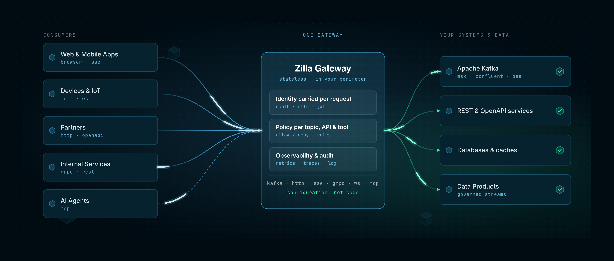
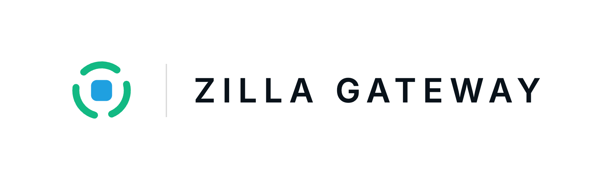
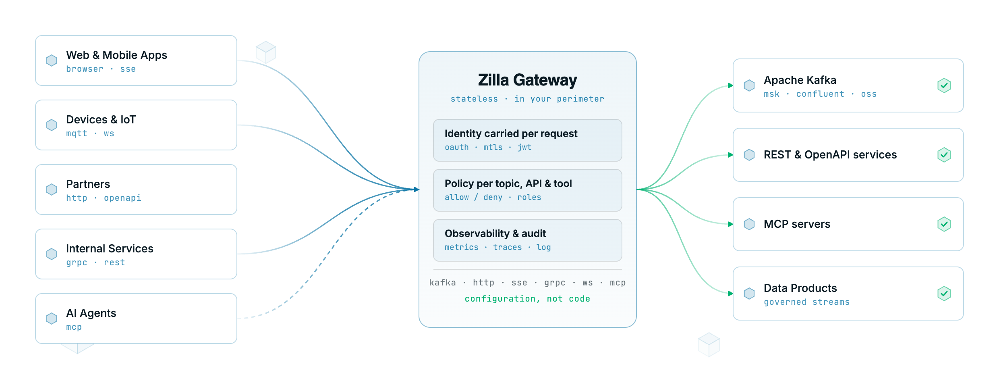

<div id="top"></div>

<div align="center">
  
  <!--  --> 
  
  <picture>
    <!-- Source for dark mode -->
    <source media="(prefers-color-scheme: dark)" srcset="./assets/zilla-gateway-lockup-dark.png">
    <source media="(prefers-color-scheme: light)" srcset="./assets/zilla-gateway-lockup-light.png">
    <!-- Fallback image for light mode and other clients -->
    
  </picture> 
  
</div>


<div align="center"> 
  
  <!--[![Build Status][build-status-image]][build-status]-->
  [![Latest Release][release-latest-image]][release-latest]
  [![Slack Community][community-image]][community-join]
  [![Artifact HUB][artifact-hub-shield]][artifact-hub]
  
</div>

<div align="center">
  <a href="https://docs.aklivity.io/latest/">Docs</a> &bull;
  <a href="https://docs.aklivity.io/latest/ai-gateway/get-started/">Quickstart</a> &bull;
  <a href="/examples">Examples</a> &bull;
  <a href="https://github.com/aklivity/zilla-demos">Demos</a> &bull;
  <a href="https://www.aklivity.io/blog">Blog</a>  
</div>


* * * * *

**Zilla** is a stateless, multi-protocol gateway for event-driven applications and AI agents.

It provides two gateway surfaces through one protocol-native engine:

- **Event Gateway** — expose Apache Kafka® and MQTT to applications, services, and devices over HTTP, SSE, gRPC, MQTT, or WebSocket.  
- **MCP Gateway** — give AI agents one governed MCP endpoint for MCP servers, HTTP APIs, OpenAPI services, and Apache Kafka.

Both are configured in a single `zilla.yaml` and share the same routing, identity, authorization, schema, telemetry, and deployment infrastructure.

> **Zilla is evolving into a unified Event and AI Gateway.** Zilla 2.0 extends the same streaming-native, multi-protocol engine that powers the Event Gateway with native MCP capabilities for connecting, governing, and observing AI agents.  
>   
> ⭐ Star this repository to follow new capabilities, examples, and Zilla 2.0 release updates.

## Why Zilla?

Browsers do not speak Kafka. IoT clients may use MQTT while the system of record uses Kafka. AI agents may need capabilities spread across MCP servers, APIs, and event streams, each with its own endpoint, credential, schema, and telemetry model.

Zilla replaces custom protocol bridges, per-provider MCP wrappers, authentication glue, and fragmented instrumentation with declarative gateway routes. Zilla is designed for exceptional scalability, adding minimal latency and throughput overhead when proxying protocols. (see [architecture](#architecture)).

## Get Started

**Prerequisite:** Docker Compose

```shell
git clone https://github.com/aklivity/zilla.git
cd zilla/examples
```

### Path 1: Event Gateway — REST over Kafka

```shell
docker compose --project-directory http.kafka.crud up -d
```

```shell
curl -X POST http://localhost:7114/items \
  -H 'Content-Type: application/json' \
  -d '{"name": "widget", "price": 9.99}'

curl http://localhost:7114/items
```

View the records in [Kafka UI](http://localhost:8080/ui/clusters/local/all-topics).

### Path 2: MCP Gateway — one endpoint for multiple providers

```shell
docker compose --project-directory mcp.proxy up -d
```

Connect an MCP client that supports Streamable HTTP to:

```
http://localhost:7114/mcp
```

Zilla aggregates the configured providers into one namespaced capability catalog and routes each request to the correct MCP server, API, or Kafka cluster.

Check MCP metrics:

```shell
curl http://localhost:7190/metrics
```

→ [AI Gateway quickstart](https://docs.aklivity.io/latest/ai-gateway/get-started/)  
→ [Browse all examples](http://./examples)

## Two Gateway Surfaces



| Capability | What Zilla does |
| :---- | :---- |
| Event access | Exposes Kafka through application-friendly protocols |
| MCP federation | Combines multiple providers behind one virtual MCP server |
| Toolkit routing | Namespaces capabilities and routes each call to the correct backend |
| HTTP and OpenAPI | Exposes existing APIs as MCP tools and resources |
| Kafka for agents | Exposes Kafka operations directly through the native MCP–Kafka binding |
| Authentication | Validates the agent identity at the gateway |
| Authorization | Controls access to endpoints, toolkits, tools, prompts, and resources |
| Context control | Supports cached listings plus eager and cold tool discovery |
| Guardrails | Validates and transforms JSON, Avro, and Protobuf payloads |
| Observability | Records MCP metrics, durations, outcomes, and lifecycle events |
| Scaling | Keeps request processing stateless and externalizes shared state when needed |

## 🆕 MCP Gateway

Zilla can connect an agent-facing MCP endpoint to:

- existing MCP servers;  
- HTTP APIs;  
- OpenAPI-described services;  
- Apache Kafka.

Capabilities are namespaced as:

```
<toolkit>__<capability>
```

For example:

```
github__create_pr
payments__refund
kafka__produce_message
```

The toolkit selects the route and avoids naming collisions across providers.

Zilla can authenticate the agent once, filter capability listings by authorization, and forward or exchange credentials for upstream services. Zilla Plus adds advanced OAuth grants and shared Redis or Hazelcast stores for multi-replica deployments.

Large catalogs can be divided into eager and cold tools so agents load only the capabilities they need. Zilla can also relay MCP elicitation, apply schema guardrails, and export telemetry without requiring changes to agents or upstream providers.

→ [MCP Gateway architecture](https://docs.aklivity.io/latest/ai-gateway/mcp-gateway/)  
→ [Security](https://docs.aklivity.io/latest/ai-gateway/security/)  
→ [Guardrails](https://docs.aklivity.io/latest/ai-gateway/guardrails/)  
→ [Observability](https://docs.aklivity.io/latest/ai-gateway/monitoring-observability/)  
→ [Configuration reference](https://docs.aklivity.io/latest/reference/2.x/)

## <a id="architecture"></a>Architecture

Zilla uses a protocol-native streaming engine designed to minimize allocation, copying, and cross-thread coordination.

- Code-generated flyweights provide typed access over encoded buffers.  
- Each connection remains assigned to one worker for its lifetime.  
- Bindings exchange back-pressured stream frames through shared memory.  
- Cache-enabled Kafka routes can fetch once and serve many downstream consumers.  
- MCP listing and authorization state can be externalized for multi-replica consistency.

→ [How Zilla Works](https://www.aklivity.io/post/how-zilla-works)

## Editions

**Zilla Community** includes the core Event Gateway and MCP Gateway.

**Zilla Plus** adds advanced OAuth, distributed stores, secure Kafka access, virtual clusters, and commercial support. Visit [aklivity.io](https://www.aklivity.io) for more details.

## Install

### Docker

```shell
docker pull ghcr.io/aklivity/zilla:latest

docker run --rm \
  -p 7114:7114 \
  -v "$(pwd)/zilla.yaml:/etc/zilla/zilla.yaml:ro" \
  ghcr.io/aklivity/zilla:latest \
  start -v
```

### Helm

```shell
helm install zilla oci://ghcr.io/aklivity/charts/zilla \
  --namespace zilla \
  --create-namespace \
  --wait \
  --values values.yaml \
  --set-file zilla\\.yaml=zilla.yaml
```

## Resources

- [📖 Documentation](https://docs.aklivity.io/latest)  
- [✨ AI Gateway](https://docs.aklivity.io/latest/ai-gateway/)  
- [⚡ Quickstart](https://docs.aklivity.io/latest/ai-gateway/get-started/)  
- [🧪 Examples](http://./examples)  
- [🎬 Demos](https://github.com/aklivity/zilla-demos)  
- [🗺️ Roadmap](https://github.com/orgs/aklivity/projects/4/views/1)  
- [💬 Discord Server](https://discord.gg/RbUeKPsxq)  
- [💬 Community Slack](https://www.aklivity.io/slack)  
- [🐛 GitHub Issues](https://github.com/aklivity/zilla/issues)  
- [🦎 Contributing](http://./.github/CONTRIBUTING.md)

## License

Zilla is made available under the [Aklivity Community License](LICENSE-AklivityCommunity).

The license allows you to deploy, run, and modify Zilla for your own workloads, including production and cloud deployments. It does not permit offering Zilla as a standalone commercial Zilla-as-a-service product.

Review the license text for the complete terms.


<!-- Links -->
[build-status-image]: https://github.com/aklivity/zilla/workflows/build/badge.svg
[build-status]: https://github.com/aklivity/zilla/actions
[community-image]: https://img.shields.io/badge/slack-@aklivitycommunity-blue.svg?logo=slack
[community-join]: https://www.aklivity.io/slack
[artifact-hub-shield]: https://img.shields.io/endpoint?url=https://artifacthub.io/badge/repository/zilla
[artifact-hub]: https://artifacthub.io/packages/helm/zilla/zilla
[release-latest-image]: https://img.shields.io/github/v/tag/aklivity/zilla?label=release
[release-latest]: https://github.com/aklivity/zilla/pkgs/container/zilla
[zilla-roadmap]: https://github.com/orgs/aklivity/projects/4/views/1

<p align="right">(<a href="#top">🔼 Back to top</a>)</p>
